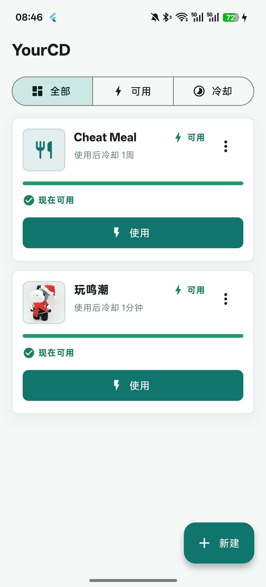
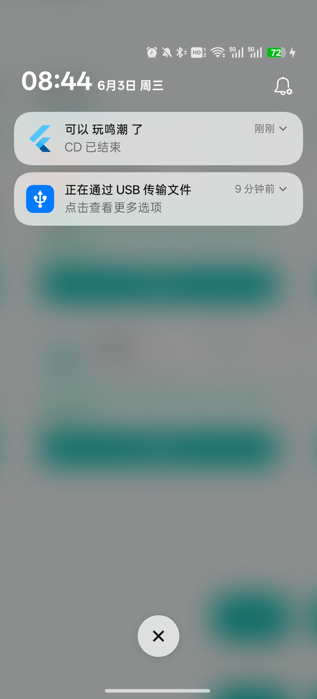

# YourCD

把“我就这一次”做成技能 CD。

欺骗餐、奶茶、游戏、刷剧、购物冲动。  
用一次，进冷却；冷却没好也能强行用，但会被记一笔。

YourCD 是一个面向 Android 的离线 Flutter 小应用。  
不联网，不登录，不说教，只帮你把下一次可用时间算清楚。

## 能做什么

- 自建技能：名字、图标、颜色、本地图片。
- 设置 CD：按时长、每天重置、每周重置。
- 查看状态：可用、冷却中、剩余时间。
- 记录破戒：强制使用会留下时间记录。
- 本地保存，可选冷却结束通知。




## 运行

```bash
flutter run
```

## 检查

```bash
flutter analyze
flutter test
```
